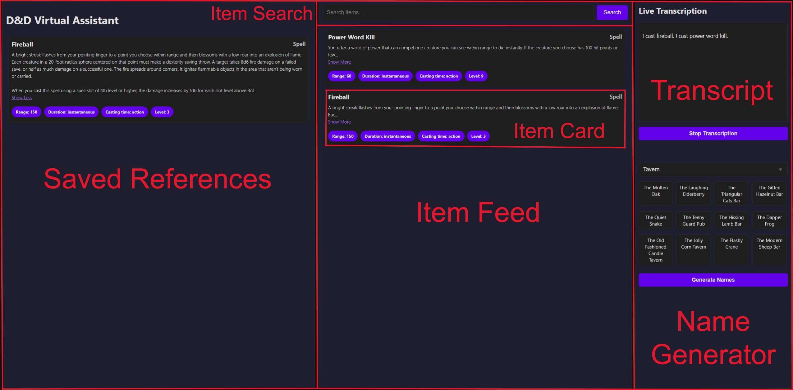

# DnD-Virtual-Assistant
<<<<<<< HEAD
## Overview
An app which will enhance your D&amp;D session by listening for keywords such as spells, items, rules, etc. and then displaying details about those keywords on a dashboard to save you time looking them up. Below is a full list of included categories.
* Spells
* Magic Items
* Monsters
* Planes
* Feats
* Conditions
* Races
* Classes
* Weapons
* Armor

### Name Generator

The app also features a random name generator that adjusts according to keywords that come up during your session. Currently, this listens for a race or category and generates names accordingly. For example, if you talk about traveling to a dwarven town, the app will generate dwarf town names. Further, if you mention drinking or alcohol it will generate tavern names. Below is a full list of the races and categories.
#### Races
* Dragonborn
* Dwarf
* Elf
* Gnome
* Goblin
* Halfling
* Human
* Orc
* Tiefling
* Troll

#### Categories
* Male
* Female
* Family
* Region
* Town
* Tavern
  
## Functionality

The D&D Virtual Assistant runs in your browser and has a single home dashboard. The right side of the dashboard displays the real-time transcript which the app will be parsing for keywords. If any matches are found, then the app will retrieve and display additional information in an item card. These appear in the item feed in the center of the dashboard. Above the item feed you will find a search bar to directly look up items. Search results will popup as cards within the item feed. You can save items to your references by double-clicking the item card. This will preserve the cards on the left side of the dashboard. In the lower right, underneath the transcript, you will notice a name generator. This will generate names based on keywords found within the transcript. You can also directly set the category and generate random names manually.

## How it works

To record the transcript I'm using Open AI's Whisper. To gather keywords and D&D information I'm using the Open5e API. To run the server I'm using Python Flask and communicating with the React frontend using sockets.